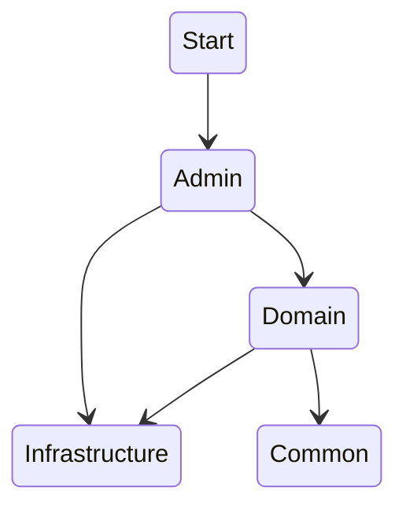

# Moon Under Java

## 项目介绍

参考：

[RouYi-Vue](https://github.com/yangzongzhuan/RuoYi-Vue)

[AgileBoot-Back-End](https://github.com/valarchie/AgileBoot-Back-End)

### 分层

moon-under-admin

moon-under-common

moon-under-domain

moon-under-infrastructure

### 代码风格

[intellij-java-google-style](https://github.com/google/styleguide/blob/gh-pages/intellij-java-google-style.xml)

### 技术栈

| 技术          | 版本         |
| ------------- | ------------ |
| Spring Boot 3 | 3.1.2        |
| Mybatis Plus  | 3.5.3.2      |
| MapStruct     | 1.5.5.Finnal |
| Lombok        | 1.18.28      |

